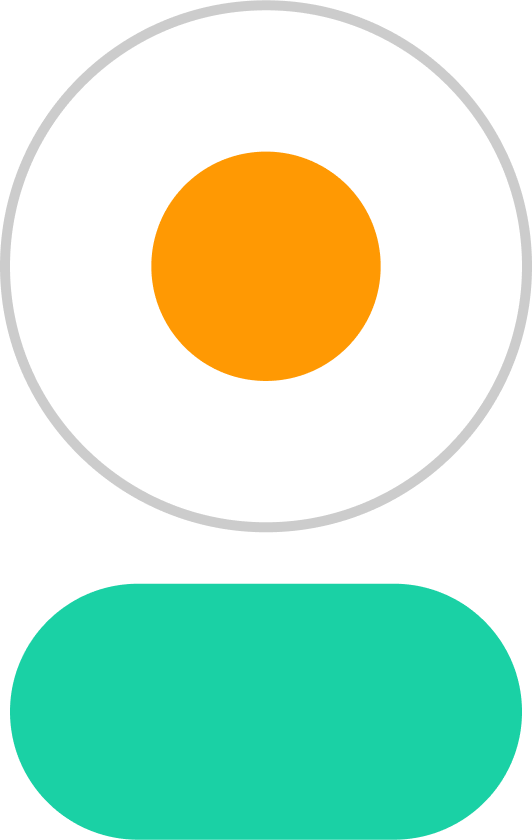

  
  &nbsp;&nbsp;&nbsp;
  

  <h4>Put DaisyUI components in your Nuxt project with ease!</h4>

# Nuxt DaisyUI

Simple to use DaisyUI components, build for Nuxt 3. It handles the details for you, so you can focus on building your application!

- Simple to set up
- Build in theme manager
- Vue interactivity set up
- Unopinionated in style
- Interactive Documentation
- Build with SSR in mind

Convinced?
[Get Started!](https://daisyui.dienst3.nl)

## License

Feel free to use this library with the [MIT](./LICENSE.md).
